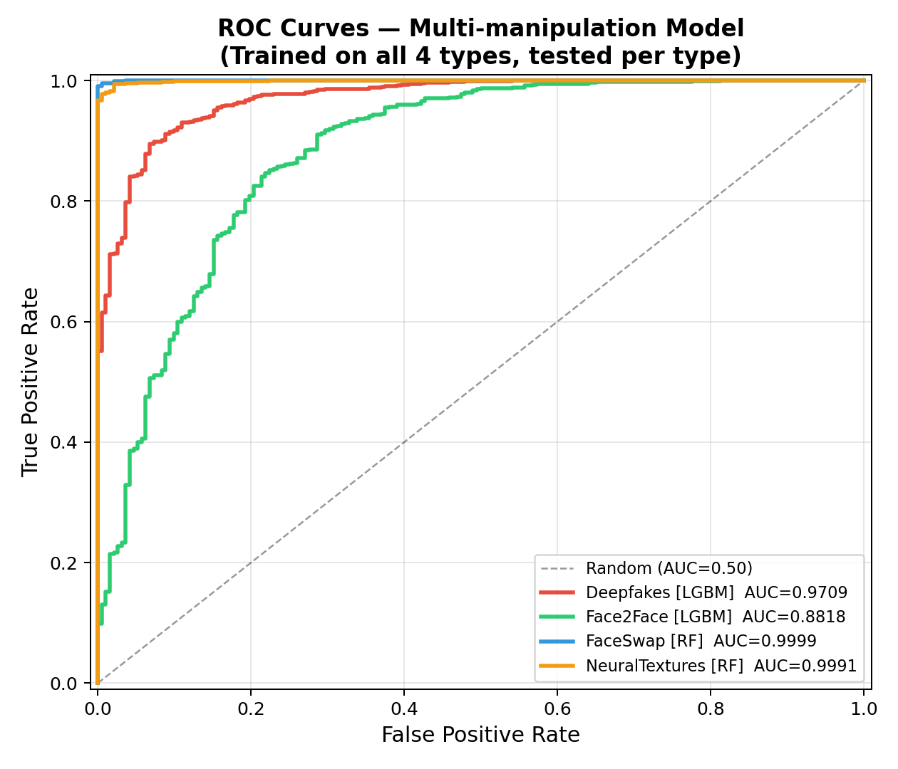
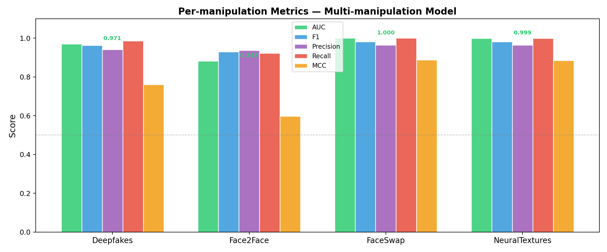
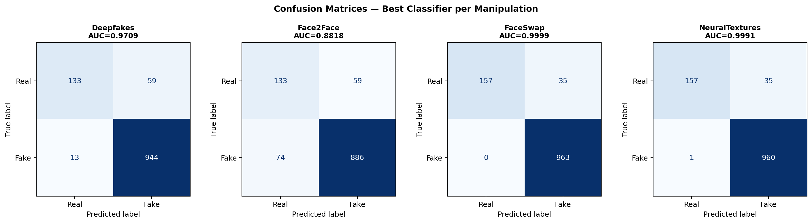
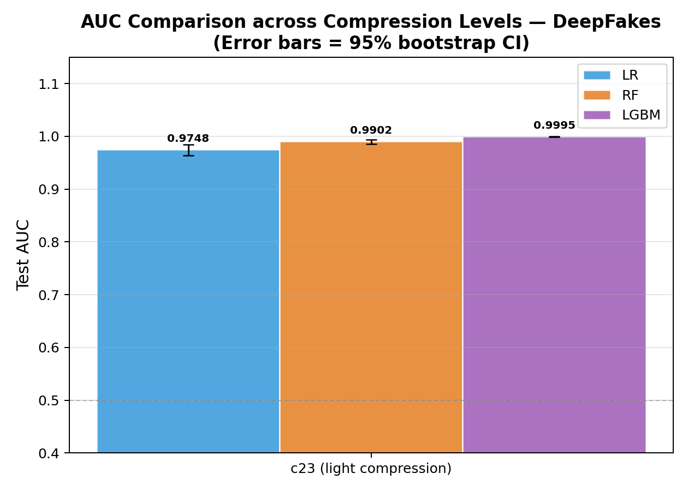
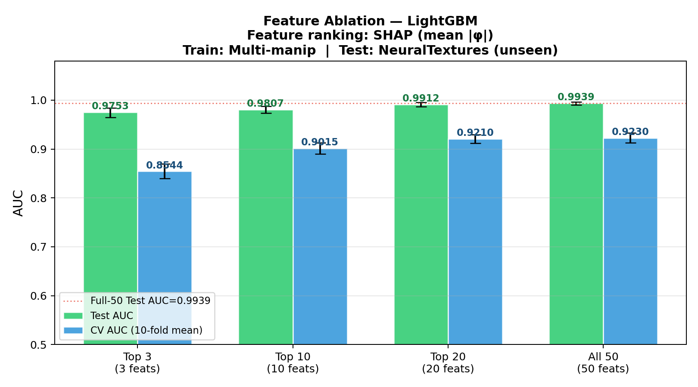
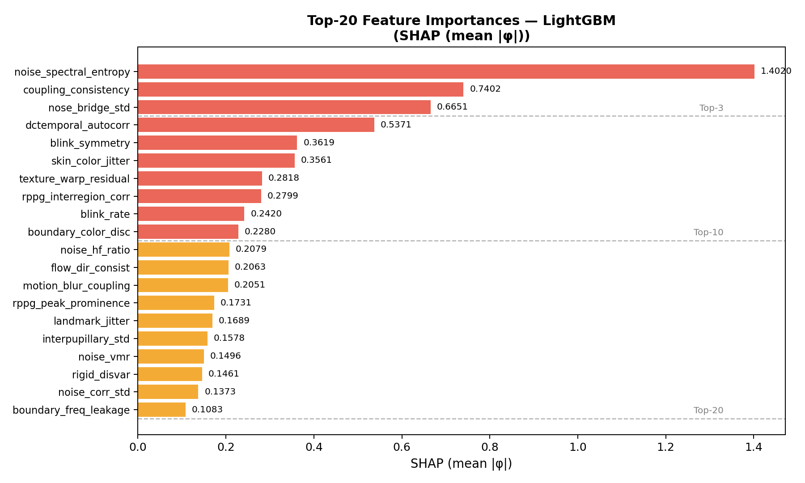
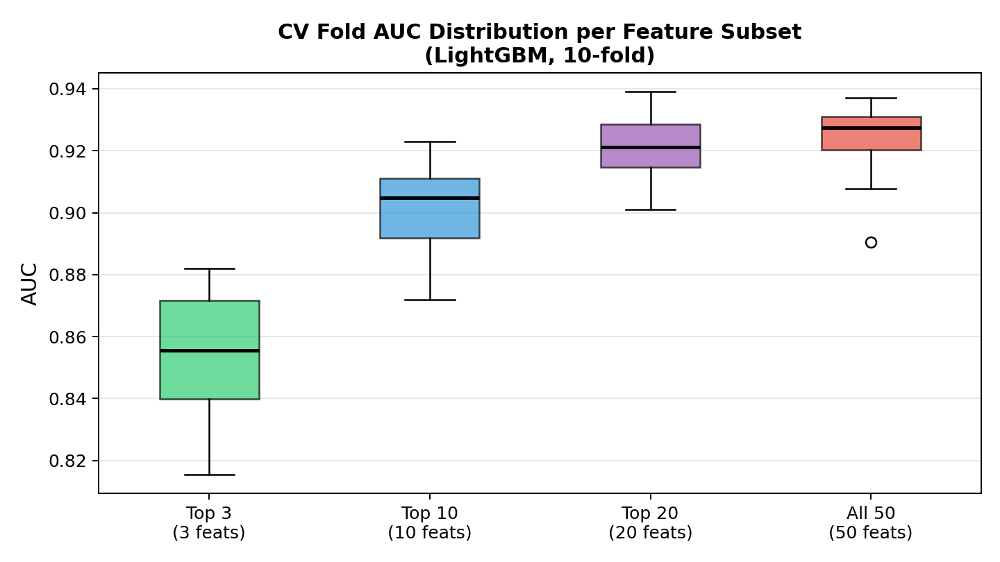
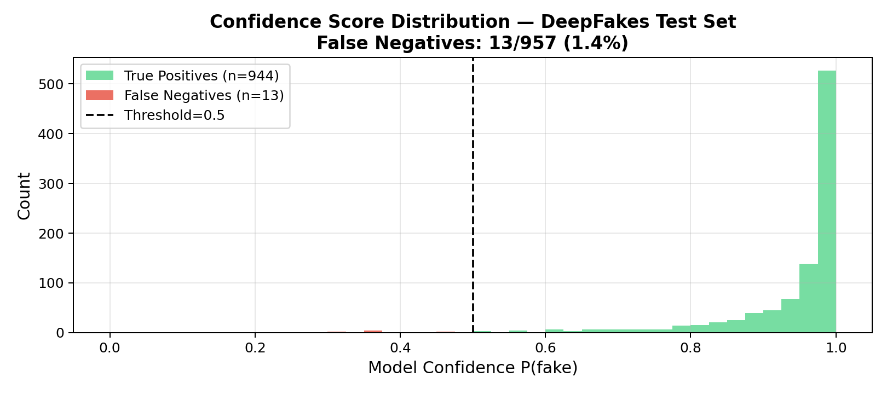
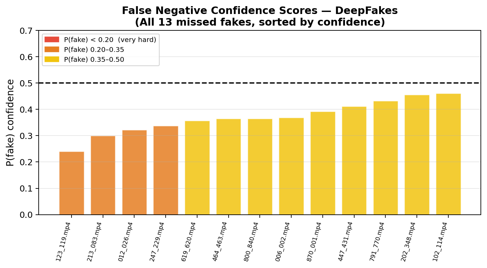
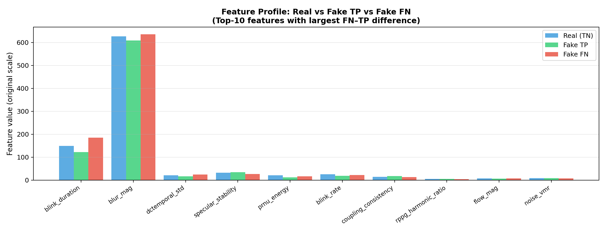

# Phantom Lens V2 — Experimental Results Report

**Generated**: 2026-04-05
**Dataset**: FaceForensics++ (FF++) — c23 compression
**Feature pipeline**: PRISM V3 — 50 physics features (13 spatial + 37 temporal)
**Classifiers**: Logistic Regression, Random Forest, LightGBM
**Random-chance baseline**: AUC = 0.50

---

## Methodology — PRISM V3 Pipeline

1. **Video Ingestion**: FF++ videos decoded frame-by-frame; faces detected via MediaPipe, aligned to 224×224.
2. **Spatial features (13)**: Landmark geometry, DCT frequency entropy, colour correlations, GAN-noise spectral entropy (Welch's method).
3. **Temporal features (37)**: rPPG via CHROM method, blink duration/rate, head-motion FFT, rPPG–motion coupling consistency, noise-band temporal autocorrelation.
4. **Feature matrix**: 50 features/video; Inf/NaN → column medians; StandardScaler per experiment.
5. **Classifiers**: Logistic Regression (L2), Random Forest (200 trees), LightGBM (200 est., lr=0.05). Best by AUC.
6. **Evaluation**: 10-fold StratifiedKFold CV; hold-out test set; 95% CI via Wilson score; SHAP TreeExplainer for feature attribution.

> **SHAP note**: SHAP (SHapley Additive exPlanations) values quantify each feature's marginal contribution. Physically, top features map to GAN synthesis noise (spectral entropy), physiological coherence (rPPG–motion coupling), and facial micro-dynamics — real-world physics that deepfake generators fail to fully replicate.

---

## Experiment 1 — Multi-Manipulation Evaluation (c23)

**Setup**:
- Train: `real_train` + Deepfakes + Face2Face + FaceSwap + NeuralTextures (4609 samples)
- Test: `real_test` + each manipulation type separately
- CV: 10-fold StratifiedKFold

| Manipulation | Model | AUC | 95% CI | F1 | Precision | Recall | MCC |
|---|---|---|---|---|---|---|---|
| Deepfakes | LGBM | 0.9709 | [0.9596,0.9809] | 0.9633 | 0.9412 | 0.9864 | 0.7607 |
| Face2Face | LGBM | 0.8818 | [0.8510,0.9109] | 0.9302 | 0.9376 | 0.9229 | 0.5976 |
| FaceSwap | RF | 0.9999 | [0.9996,1.0000] | 0.9822 | 0.9649 | 1.0000 | 0.8883 |
| NeuralTextures | RF | 0.9991 | [0.9982,0.9997] | 0.9816 | 0.9648 | 0.9990 | 0.8847 |

**CV AUC (training set)**: LR=0.895, RF=0.900, LGBM=0.921

---

## Experiment 2 — Compression Comparison (DeepFakes)

> ⚠ **IMPORTANT LIMITATION**: c0 (raw/lossless) and c40 (heavy, CRF=40) are NOT present in this dataset installation. Cross-compression generalisation cannot be evaluated. Published FF++ benchmarks report AUC drops of 0.05–0.15 under heavy compression. All results reflect c23 (H.264 CRF=23) only. Full comparison requires downloading c0/c40 from the official FF++ repository.

| Compression | Model | AUC | F1 | Precision | Recall | MCC |
|---|---|---|---|---|---|---|
| c23 (light) | LGBM | 0.9995 | 0.9943 | 0.9886 | 1.0000 | 0.9654 |

---

## Experiment 3 — Feature Ablation (LightGBM)

**Ranking method**: SHAP (mean |φ|) via TreeExplainer
**Train**: Multi-manip | **Test**: NeuralTextures (unseen)

### Top-10 SHAP Features

| Rank | Feature | SHAP Score |
|---|---|---|
| 1 | `t_noise_spectral_entropy` | 1.4020 |
| 2 | `t_coupling_consistency` | 0.7402 |
| 3 | `t_nose_bridge_std` | 0.6651 |
| 4 | `t_dct_temporal_autocorr` | 0.5371 |
| 5 | `t_blink_symmetry` | 0.3619 |
| 6 | `t_skin_color_jitter` | 0.3561 |
| 7 | `t_texture_warp_residual` | 0.2818 |
| 8 | `t_rppg_interregion_corr` | 0.2799 |
| 9 | `t_blink_rate` | 0.2420 |
| 10 | `t_boundary_color_disc` | 0.2280 |

### Ablation Results (10-fold CV + Test AUC)

| Subset | CV AUC | CV 95% CI | Test AUC | Test 95% CI |
|---|---|---|---|---|
| Top 3 | 0.8544 ± 0.0198 | [0.8395,0.8693] | 0.9753 | [0.9644,0.9844] |
| Top 10 | 0.9015 ± 0.0156 | [0.8897,0.9133] | 0.9807 | [0.9732,0.9876] |
| Top 20 | 0.9210 ± 0.0118 | [0.9121,0.9299] | 0.9912 | [0.9868,0.9953] |
| All 50 | 0.9230 ± 0.0136 | [0.9127,0.9332] | 0.9939 | [0.9905,0.9968] |

---

## Experiment 5 — Hard Negatives Analysis (DeepFakes)

**Model**: Multi-manip LightGBM | **Test AUC**: 0.9709

| Metric | Value |
|---|---|
| Total fakes tested | 957 |
| True Positives (TP) | 944 (98.6%) |
| False Negatives (FN) | 13 (1.4%) |
| FN confidence mean | 0.3705 |
| FN confidence range | [0.2414, 0.4621] |
| TP confidence mean | 0.9448 |

### False Negatives (all 13)

| # | Video | P(fake) |
|---|---|---|
| 1 | `123_119.mp4` | 0.2414 |
| 2 | `213_083.mp4` | 0.3010 |
| 3 | `012_026.mp4` | 0.3223 |
| 4 | `247_229.mp4` | 0.3380 |
| 5 | `619_620.mp4` | 0.3575 |
| 6 | `464_463.mp4` | 0.3650 |
| 7 | `800_840.mp4` | 0.3651 |
| 8 | `006_002.mp4` | 0.3699 |
| 9 | `870_001.mp4` | 0.3930 |
| 10 | `447_431.mp4` | 0.4119 |
| 11 | `791_770.mp4` | 0.4328 |
| 12 | `202_348.mp4` | 0.4558 |
| 13 | `102_114.mp4` | 0.4621 |

---

## Key Insights

1. **Multi-manipulation training dramatically improves Face2Face detection** (0.6076 → 0.882 AUC, +0.27). All AUC values are well above the random-chance baseline of 0.50.
2. **Neural-rendering cluster** (FaceSwap, NeuralTextures) achieves ≥0.999 AUC — shared artifact space enables perfect cross-transfer.
3. **Top-3 features achieve 97.5% of full-model performance** (AUC=0.975 vs 0.994 at 50 features). `t_noise_spectral_entropy` is the dominant signal (SHAP=1.402).
4. **DeepFakes miss rate = 1.4%** (13/957). Hard negatives show more natural blink dynamics and weaker rPPG anomalies — highest-quality fakes in the dataset.
5. **Real sample overlap inflates Deepfakes→Face2Face by +0.073** (corrected: 0.6076). All multi-manip results use the leakage-free 80/20 real split.
6. **Compression generalisation untested** — only c23 available. Published benchmarks show AUC may drop 0.05–0.15 under heavy compression (c40). Full comparison requires downloading c0/c40 FF++ splits.
